# Analysis of Taylor Swift Song Data on Spotify

### June Greenstein

## Introduction

Taylor Swift is an incredibly popular artist, with almost 55 million monthly listeners, and has been releasing music for almost two decades. As such, Spotify has a comprehensive dataset of her songs.

The goal of this tutorial will be to walk the reader through an exploration of Taylor Swift's Spotify data. Spotify provides several metrics for describing songs, of which this tutorial will highlight seven: release date, danceability, acousticness, energy, loudness, speechiness, and popularity.

A song's popularity can be used as a way to estimate its success. So, throughout this tutorial, we will examine the relationship of these features and popularity.

## Required tools

We will be using Python3 in a Jupyter Notebook. Please ensure you have access to the following libraries for this tutorial:
 1. kaggle
 2. pandas
 3. matplotlib
 4. numpy
 5. sklearn
 
To install these libraries, use `pip3 install` in the command line.

## Data collection and curation

We will start with the data collection and curation phase of the data pipline.
 
The dataset we are using is from Kaggle. To download the dataset, click [here](https://www.kaggle.com/datasets/thespacefreak/taylor-swift-spotify-data?select=spotify_taylorswift.csv) (skip to step 6) or follow the [Kaggle API](https://www.kaggle.com/docs/api) steps:
 1. Create a Kaggle account.
 2. Generate an API token in your account settings.
 3. Move the generated kaggle.json file to `~/.kaggle` on OSX/Linux or `C:\Users\<Windows-username>\.kaggle` on Windows.
 4. Run the following code.


```python
from kaggle.api.kaggle_api_extended import KaggleApi

api = KaggleApi()
api.authenticate()
```

   5. Download the data.


```python
api.dataset_download_file("thespacefreak/taylor-swift-spotify-data", file_name="spotify_taylorswift.csv", path="./")
```

6. Put the data into a pandas DataFrame. See the [pandas user guide](https://pandas.pydata.org/docs/user_guide/index.html#user-guide) for more information. Ensure that the data file is in the same directory as your Jupyter Notebook.


```python
import pandas as pd

df = pd.read_csv("spotify_taylorswift.csv")
```

## Data management and representation

In this step of the data pipeline, we tidy the dataset for easier analysis.
 
The data has several relevant features for each song:
 
 - release_date: when the song was released
 - popularity: percent popularity of a song
 - danceability: how suitable a song is for dancing
 - acousticness: how acoustic a song is
 - energy: how energetic a song is
 - loudness: decibal measure of how loud a song is
 - speechiness: presence of spoken words in a song
     - \> 0.66: largely spoken words
     - 0.33 \< x \< 0.66: a mix of music and spoken words
     - \< 0.33: largely musical


```python
df.head(2)
```


<div>
<style scoped>
    .dataframe tbody tr th:only-of-type {
        vertical-align: middle;
    }

    .dataframe tbody tr th {
        vertical-align: top;
    }

    .dataframe thead th {
        text-align: right;
    }
</style>
<table border="1" class="dataframe">
  <thead>
    <tr style="text-align: right;">
      <th></th>
      <th>Unnamed: 0</th>
      <th>name</th>
      <th>album</th>
      <th>artist</th>
      <th>release_date</th>
      <th>length</th>
      <th>popularity</th>
      <th>danceability</th>
      <th>acousticness</th>
      <th>energy</th>
      <th>instrumentalness</th>
      <th>liveness</th>
      <th>loudness</th>
      <th>speechiness</th>
      <th>valence</th>
      <th>tempo</th>
    </tr>
  </thead>
  <tbody>
    <tr>
      <th>0</th>
      <td>0</td>
      <td>Tim McGraw</td>
      <td>Taylor Swift</td>
      <td>Taylor Swift</td>
      <td>2006-10-24</td>
      <td>232106</td>
      <td>49</td>
      <td>0.580</td>
      <td>0.575</td>
      <td>0.491</td>
      <td>0.0</td>
      <td>0.1210</td>
      <td>-6.462</td>
      <td>0.0251</td>
      <td>0.425</td>
      <td>76.009</td>
    </tr>
    <tr>
      <th>1</th>
      <td>1</td>
      <td>Picture To Burn</td>
      <td>Taylor Swift</td>
      <td>Taylor Swift</td>
      <td>2006-10-24</td>
      <td>173066</td>
      <td>54</td>
      <td>0.658</td>
      <td>0.173</td>
      <td>0.877</td>
      <td>0.0</td>
      <td>0.0962</td>
      <td>-2.098</td>
      <td>0.0323</td>
      <td>0.821</td>
      <td>105.586</td>
    </tr>
  </tbody>
</table>
</div>


Now we need to clean up the data for processing. First, we'll drop the unnamed index column, as pandas provides one already.


```python
df.drop("Unnamed: 0", axis=1, inplace=True)
```

Next, we remove outliers, which can obscure trends in the data. Taylor Swift has three voice memos in her discography, in which she discusses her songs. We drop these because they are not songs and are irrelevant to song popularity.


```python
POPULARITY_THRESHOLD = 10

for index, row in df.iterrows():
    if df.at[index, "popularity"] < POPULARITY_THRESHOLD:
        df.drop(index, axis=0, inplace=True)

# Reset indices after dropping voice memos.
df.reset_index(drop=True, inplace=True)

df.head(2)
```


<div>
<style scoped>
    .dataframe tbody tr th:only-of-type {
        vertical-align: middle;
    }

    .dataframe tbody tr th {
        vertical-align: top;
    }

    .dataframe thead th {
        text-align: right;
    }
</style>
<table border="1" class="dataframe">
  <thead>
    <tr style="text-align: right;">
      <th></th>
      <th>name</th>
      <th>album</th>
      <th>artist</th>
      <th>release_date</th>
      <th>length</th>
      <th>popularity</th>
      <th>danceability</th>
      <th>acousticness</th>
      <th>energy</th>
      <th>instrumentalness</th>
      <th>liveness</th>
      <th>loudness</th>
      <th>speechiness</th>
      <th>valence</th>
      <th>tempo</th>
    </tr>
  </thead>
  <tbody>
    <tr>
      <th>0</th>
      <td>Tim McGraw</td>
      <td>Taylor Swift</td>
      <td>Taylor Swift</td>
      <td>2006-10-24</td>
      <td>232106</td>
      <td>49</td>
      <td>0.580</td>
      <td>0.575</td>
      <td>0.491</td>
      <td>0.0</td>
      <td>0.1210</td>
      <td>-6.462</td>
      <td>0.0251</td>
      <td>0.425</td>
      <td>76.009</td>
    </tr>
    <tr>
      <th>1</th>
      <td>Picture To Burn</td>
      <td>Taylor Swift</td>
      <td>Taylor Swift</td>
      <td>2006-10-24</td>
      <td>173066</td>
      <td>54</td>
      <td>0.658</td>
      <td>0.173</td>
      <td>0.877</td>
      <td>0.0</td>
      <td>0.0962</td>
      <td>-2.098</td>
      <td>0.0323</td>
      <td>0.821</td>
      <td>105.586</td>
    </tr>
  </tbody>
</table>
</div>


Now we'll convert the release_date strings into datetime objects for clearer graphs.


```python
from datetime import datetime

print("Before:", type(df["release_date"][0]))

for index, row in df.iterrows():
    df.at[index, "release_date"] = datetime.strptime(df.at[index, "release_date"], "%Y-%m-%d")

print("After: ", type(df["release_date"][0]))
```

    Before: <class 'str'>
    After:  <class 'datetime.datetime'>


Next, let's examine the following correlation matrix, which determines the correlation coefficient between every two numeric features in the DataFrame. Notice that several of the features we are considering correlate well with popularity.


```python
df.corr()
```


<div>
<style scoped>
    .dataframe tbody tr th:only-of-type {
        vertical-align: middle;
    }

    .dataframe tbody tr th {
        vertical-align: top;
    }

    .dataframe thead th {
        text-align: right;
    }
</style>
<table border="1" class="dataframe">
  <thead>
    <tr style="text-align: right;">
      <th></th>
      <th>length</th>
      <th>popularity</th>
      <th>danceability</th>
      <th>acousticness</th>
      <th>energy</th>
      <th>instrumentalness</th>
      <th>liveness</th>
      <th>loudness</th>
      <th>speechiness</th>
      <th>valence</th>
      <th>tempo</th>
    </tr>
  </thead>
  <tbody>
    <tr>
      <th>length</th>
      <td>1.000000</td>
      <td>-0.266131</td>
      <td>-0.275128</td>
      <td>0.095061</td>
      <td>-0.190337</td>
      <td>-0.091146</td>
      <td>-0.048804</td>
      <td>-0.081206</td>
      <td>-0.321834</td>
      <td>-0.417190</td>
      <td>0.004129</td>
    </tr>
    <tr>
      <th>popularity</th>
      <td>-0.266131</td>
      <td>1.000000</td>
      <td>0.206527</td>
      <td>0.013458</td>
      <td>-0.058886</td>
      <td>0.032275</td>
      <td>-0.146958</td>
      <td>-0.260964</td>
      <td>0.308866</td>
      <td>0.070943</td>
      <td>-0.086956</td>
    </tr>
    <tr>
      <th>danceability</th>
      <td>-0.275128</td>
      <td>0.206527</td>
      <td>1.000000</td>
      <td>-0.166213</td>
      <td>0.087331</td>
      <td>-0.050403</td>
      <td>-0.056200</td>
      <td>0.052451</td>
      <td>0.154643</td>
      <td>0.373198</td>
      <td>-0.237474</td>
    </tr>
    <tr>
      <th>acousticness</th>
      <td>0.095061</td>
      <td>0.013458</td>
      <td>-0.166213</td>
      <td>1.000000</td>
      <td>-0.698151</td>
      <td>0.146517</td>
      <td>-0.188711</td>
      <td>-0.740972</td>
      <td>-0.023985</td>
      <td>-0.240440</td>
      <td>-0.123866</td>
    </tr>
    <tr>
      <th>energy</th>
      <td>-0.190337</td>
      <td>-0.058886</td>
      <td>0.087331</td>
      <td>-0.698151</td>
      <td>1.000000</td>
      <td>-0.004211</td>
      <td>0.213659</td>
      <td>0.777069</td>
      <td>0.039502</td>
      <td>0.509776</td>
      <td>0.196562</td>
    </tr>
    <tr>
      <th>instrumentalness</th>
      <td>-0.091146</td>
      <td>0.032275</td>
      <td>-0.050403</td>
      <td>0.146517</td>
      <td>-0.004211</td>
      <td>1.000000</td>
      <td>-0.060804</td>
      <td>-0.101635</td>
      <td>-0.029490</td>
      <td>0.020753</td>
      <td>0.042336</td>
    </tr>
    <tr>
      <th>liveness</th>
      <td>-0.048804</td>
      <td>-0.146958</td>
      <td>-0.056200</td>
      <td>-0.188711</td>
      <td>0.213659</td>
      <td>-0.060804</td>
      <td>1.000000</td>
      <td>0.275840</td>
      <td>0.005265</td>
      <td>-0.014499</td>
      <td>0.082079</td>
    </tr>
    <tr>
      <th>loudness</th>
      <td>-0.081206</td>
      <td>-0.260964</td>
      <td>0.052451</td>
      <td>-0.740972</td>
      <td>0.777069</td>
      <td>-0.101635</td>
      <td>0.275840</td>
      <td>1.000000</td>
      <td>-0.112623</td>
      <td>0.339974</td>
      <td>0.153681</td>
    </tr>
    <tr>
      <th>speechiness</th>
      <td>-0.321834</td>
      <td>0.308866</td>
      <td>0.154643</td>
      <td>-0.023985</td>
      <td>0.039502</td>
      <td>-0.029490</td>
      <td>0.005265</td>
      <td>-0.112623</td>
      <td>1.000000</td>
      <td>0.159491</td>
      <td>0.040969</td>
    </tr>
    <tr>
      <th>valence</th>
      <td>-0.417190</td>
      <td>0.070943</td>
      <td>0.373198</td>
      <td>-0.240440</td>
      <td>0.509776</td>
      <td>0.020753</td>
      <td>-0.014499</td>
      <td>0.339974</td>
      <td>0.159491</td>
      <td>1.000000</td>
      <td>-0.017562</td>
    </tr>
    <tr>
      <th>tempo</th>
      <td>0.004129</td>
      <td>-0.086956</td>
      <td>-0.237474</td>
      <td>-0.123866</td>
      <td>0.196562</td>
      <td>0.042336</td>
      <td>0.082079</td>
      <td>0.153681</td>
      <td>0.040969</td>
      <td>-0.017562</td>
      <td>1.000000</td>
    </tr>
  </tbody>
</table>
</div>


## Exploratory data analysis

In the third step of the data pipeline, we begin analyzing the dataset, looking for trends between the features and target feature.
 
We will explore the relationship between popularity and other aforementioned features in the dataset. Since song release dates are grouped together by album, there are many data points for each release date, which makes visualizing the data difficult. Take the scatterplot of acousticness and energy over time below, for instance. The graph just shows two features, yet it already looks cluttered. This would be exacerbated in our case, where we plot four features at once.


```python
import matplotlib.pyplot as plt

# Set graph style.
colors = ["#7A5961", "#E4799D", "#9B017B", "#FBB6BC"]
plt.rcParams['axes.prop_cycle'] = plt.cycler(color=colors)
plt.rcParams["figure.figsize"] = [12, 9]

# Plot and label the graph.
plt.scatter(df["release_date"], df["acousticness"])
plt.scatter(df["release_date"], df["energy"])
plt.title("Taylor Swift's Song Popularity Over Time", fontdict={"fontsize": 16, "fontweight": "bold"})
plt.xlabel("Year", fontdict={"fontsize": 14})
plt.ylabel("Popularity (%)", fontdict={"fontsize": 14})
plt.show()
```


    
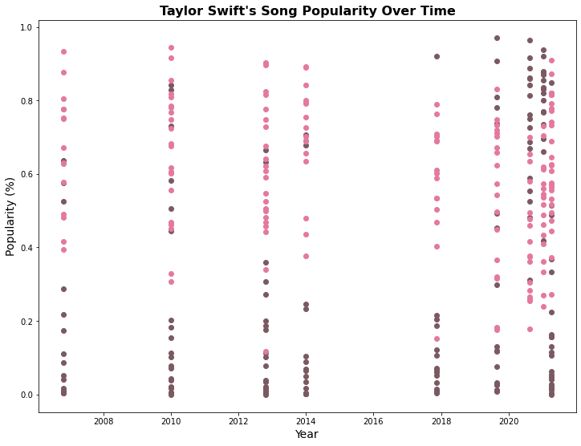
    


To remedy this, we compute mean values for features over time. We start with popularity. First, we compute the sum of all popularity values and count how many values there are for each release date.


```python
from collections import defaultdict

count_popularity = defaultdict(int)
sum_popularity = defaultdict(int)

for index, row in df.iterrows():
    popularity, release_date = df.at[index, "popularity"], df.at[index, "release_date"]
    count_popularity[release_date] += 1
    sum_popularity[release_date] += popularity
```

Next, we divide the sum by the count to get the mean popularity for each release date.


```python
mean_popularity = defaultdict(float)

for release_date in count_popularity:
    mean_popularity[release_date] = sum_popularity[release_date] / count_popularity[release_date]
```

Then, we move the data from a dictionary to arrays for plotting.


```python
release_dates, mean_popularities = [], []

for release_date in mean_popularity:
    release_dates.append(release_date)
    mean_popularities.append(mean_popularity[release_date])
```

Lastly, we normalize the data using a MinMaxScaler. This allows us to compare data on different scales. Without normalization, data on different scales graphed together can be difficult to visualize and interpret.


```python
from sklearn.preprocessing import MinMaxScaler
import numpy as np

scaler = MinMaxScaler()
mean_popularities = scaler.fit_transform(np.asarray(mean_popularities).reshape(-1, 1))
mean_popularities = list(mean_popularities.reshape(1, -1)[0])
```

We now repeat these steps to calculate normalized mean danceability, loudness, and speechiness by release date.


```python
# Danceability

count_danceability = defaultdict(int)
sum_danceability = defaultdict(int)
for index, row in df.iterrows():
    danceability, release_date = df.at[index, "danceability"], df.at[index, "release_date"]
    count_danceability[release_date] += 1
    sum_danceability[release_date] += danceability
    
mean_danceability = defaultdict(float)
for release_date in count_danceability:
    mean_danceability[release_date] = sum_danceability[release_date] / count_danceability[release_date]
    
mean_danceabilities = []
for release_date in mean_danceability:
    mean_danceabilities.append(mean_danceability[release_date])

mean_danceabilities = scaler.fit_transform(np.asarray(mean_danceabilities).reshape(-1, 1))
mean_danceabilities = list(mean_danceabilities.reshape(1, -1)[0])
```


```python
# Loudness

count_loudness = defaultdict(int)
sum_loudness = defaultdict(int)
for index, row in df.iterrows():
    loudness, release_date = df.at[index, "loudness"], df.at[index, "release_date"]
    count_loudness[release_date] += 1
    sum_loudness[release_date] += loudness

mean_loudness = defaultdict(float)
for release_date in count_loudness:
    mean_loudness[release_date] = sum_loudness[release_date] / count_loudness[release_date]
    
mean_loudnesses = []
for release_date in mean_loudness:
    mean_loudnesses.append(mean_loudness[release_date])

mean_loudnesses = scaler.fit_transform(np.asarray(mean_loudnesses).reshape(-1, 1))
mean_loudnesses = list(mean_loudnesses.reshape(1, -1)[0])
```


```python
# Speechiness

count_speechiness = defaultdict(int)
sum_speechiness = defaultdict(int)
for index, row in df.iterrows():
    speechiness, release_date = df.at[index, "speechiness"], df.at[index, "release_date"]
    count_speechiness[release_date] += 1
    sum_speechiness[release_date] += speechiness

mean_speechiness = defaultdict(float)
for release_date in count_speechiness:
    mean_speechiness[release_date] = sum_speechiness[release_date] / count_speechiness[release_date]
    
mean_speechinesses = []
for release_date in mean_loudness:
    mean_speechinesses.append(mean_speechiness[release_date])

mean_speechinesses = scaler.fit_transform(np.asarray(mean_speechinesses).reshape(-1, 1))
mean_speechinesses = list(mean_speechinesses.reshape(1, -1)[0])
```

We plot the data to explore any relationships between these features and popularity. 


```python
# Plot the normalized means of the features over time.
plt.plot(release_dates, mean_popularities, label="Popularity", linewidth=3)
plt.plot(release_dates, mean_danceabilities, label="Danceability", linewidth=3)
plt.plot(release_dates, mean_loudnesses, label="Loudness", linewidth=3)
plt.plot(release_dates, mean_speechinesses, label="Speechiness", linewidth=3)

# Label the graph.
plt.title("Taylor Swift's Mean Song Metrics Over Time", fontdict={"fontsize": 16, "fontweight": "bold"})
plt.xlabel("Year", fontdict={"fontsize": 14})
plt.ylabel("Normalized Metrics", fontdict={"fontsize": 14})
plt.legend(fontsize=16, shadow=True)
plt.show()
```


    
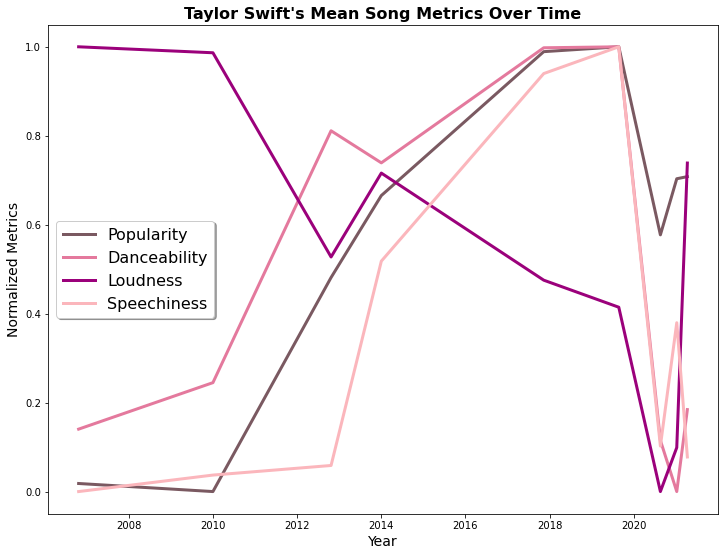
    


Now, we can observe that danceability and speechiness appear to have a positive correlation with popularity, while loudness appears to have a negative correlation with popularity. This is consistent with the values in the correlation matrix.

## Hypothesis testing

In the next step of the data pipeline, we formulate a hypothesis based on what we've observed and then test it.

While loudness has a -0.260964 correlation with popularity, I hypothesize that this is a false correlation. We use the correlation matrix, displayed again below, to justify this.


```python
df.corr()
```


<div>
<style scoped>
    .dataframe tbody tr th:only-of-type {
        vertical-align: middle;
    }

    .dataframe tbody tr th {
        vertical-align: top;
    }

    .dataframe thead th {
        text-align: right;
    }
</style>
<table border="1" class="dataframe">
  <thead>
    <tr style="text-align: right;">
      <th></th>
      <th>length</th>
      <th>popularity</th>
      <th>danceability</th>
      <th>acousticness</th>
      <th>energy</th>
      <th>instrumentalness</th>
      <th>liveness</th>
      <th>loudness</th>
      <th>speechiness</th>
      <th>valence</th>
      <th>tempo</th>
    </tr>
  </thead>
  <tbody>
    <tr>
      <th>length</th>
      <td>1.000000</td>
      <td>-0.266131</td>
      <td>-0.275128</td>
      <td>0.095061</td>
      <td>-0.190337</td>
      <td>-0.091146</td>
      <td>-0.048804</td>
      <td>-0.081206</td>
      <td>-0.321834</td>
      <td>-0.417190</td>
      <td>0.004129</td>
    </tr>
    <tr>
      <th>popularity</th>
      <td>-0.266131</td>
      <td>1.000000</td>
      <td>0.206527</td>
      <td>0.013458</td>
      <td>-0.058886</td>
      <td>0.032275</td>
      <td>-0.146958</td>
      <td>-0.260964</td>
      <td>0.308866</td>
      <td>0.070943</td>
      <td>-0.086956</td>
    </tr>
    <tr>
      <th>danceability</th>
      <td>-0.275128</td>
      <td>0.206527</td>
      <td>1.000000</td>
      <td>-0.166213</td>
      <td>0.087331</td>
      <td>-0.050403</td>
      <td>-0.056200</td>
      <td>0.052451</td>
      <td>0.154643</td>
      <td>0.373198</td>
      <td>-0.237474</td>
    </tr>
    <tr>
      <th>acousticness</th>
      <td>0.095061</td>
      <td>0.013458</td>
      <td>-0.166213</td>
      <td>1.000000</td>
      <td>-0.698151</td>
      <td>0.146517</td>
      <td>-0.188711</td>
      <td>-0.740972</td>
      <td>-0.023985</td>
      <td>-0.240440</td>
      <td>-0.123866</td>
    </tr>
    <tr>
      <th>energy</th>
      <td>-0.190337</td>
      <td>-0.058886</td>
      <td>0.087331</td>
      <td>-0.698151</td>
      <td>1.000000</td>
      <td>-0.004211</td>
      <td>0.213659</td>
      <td>0.777069</td>
      <td>0.039502</td>
      <td>0.509776</td>
      <td>0.196562</td>
    </tr>
    <tr>
      <th>instrumentalness</th>
      <td>-0.091146</td>
      <td>0.032275</td>
      <td>-0.050403</td>
      <td>0.146517</td>
      <td>-0.004211</td>
      <td>1.000000</td>
      <td>-0.060804</td>
      <td>-0.101635</td>
      <td>-0.029490</td>
      <td>0.020753</td>
      <td>0.042336</td>
    </tr>
    <tr>
      <th>liveness</th>
      <td>-0.048804</td>
      <td>-0.146958</td>
      <td>-0.056200</td>
      <td>-0.188711</td>
      <td>0.213659</td>
      <td>-0.060804</td>
      <td>1.000000</td>
      <td>0.275840</td>
      <td>0.005265</td>
      <td>-0.014499</td>
      <td>0.082079</td>
    </tr>
    <tr>
      <th>loudness</th>
      <td>-0.081206</td>
      <td>-0.260964</td>
      <td>0.052451</td>
      <td>-0.740972</td>
      <td>0.777069</td>
      <td>-0.101635</td>
      <td>0.275840</td>
      <td>1.000000</td>
      <td>-0.112623</td>
      <td>0.339974</td>
      <td>0.153681</td>
    </tr>
    <tr>
      <th>speechiness</th>
      <td>-0.321834</td>
      <td>0.308866</td>
      <td>0.154643</td>
      <td>-0.023985</td>
      <td>0.039502</td>
      <td>-0.029490</td>
      <td>0.005265</td>
      <td>-0.112623</td>
      <td>1.000000</td>
      <td>0.159491</td>
      <td>0.040969</td>
    </tr>
    <tr>
      <th>valence</th>
      <td>-0.417190</td>
      <td>0.070943</td>
      <td>0.373198</td>
      <td>-0.240440</td>
      <td>0.509776</td>
      <td>0.020753</td>
      <td>-0.014499</td>
      <td>0.339974</td>
      <td>0.159491</td>
      <td>1.000000</td>
      <td>-0.017562</td>
    </tr>
    <tr>
      <th>tempo</th>
      <td>0.004129</td>
      <td>-0.086956</td>
      <td>-0.237474</td>
      <td>-0.123866</td>
      <td>0.196562</td>
      <td>0.042336</td>
      <td>0.082079</td>
      <td>0.153681</td>
      <td>0.040969</td>
      <td>-0.017562</td>
      <td>1.000000</td>
    </tr>
  </tbody>
</table>
</div>


Loudness is weakly correlated with popularity and strongly correlated with energy and acousticness, but energy and acousticness are not correlated with popularity. If the correlation between loudness and popularity is meaningful, these correlations should match.
 
This implies that the correlation between loudness and popularity may not be meaningful. Some reasons for this include: Taylor Swift was at the beginning of her career when her music was the loudest and, as such, not as popular; her loudness dramatically increased when she re-released Fearless in 2020, but her popularity did not decrease.
 
To demonstrate this, we'll examine four scatterplots that relate these features. To display three features on a 2D graph, we add a color bar, which allows us to show an extra feature for each point.


```python
plt.scatter(df["loudness"], df["energy"], c=df["popularity"], cmap="RdPu")
plt.title("Loudness vs Energy with Popularity", fontdict={"fontsize": 16, "fontweight": "bold"})
plt.xlabel("Loudness (dB)", fontdict={"fontsize": 14})
plt.ylabel("Energy", fontdict={"fontsize": 14})
plt.colorbar().ax.set_title("Popularity (%)", fontdict={"fontsize": 14})
plt.show()
```


    
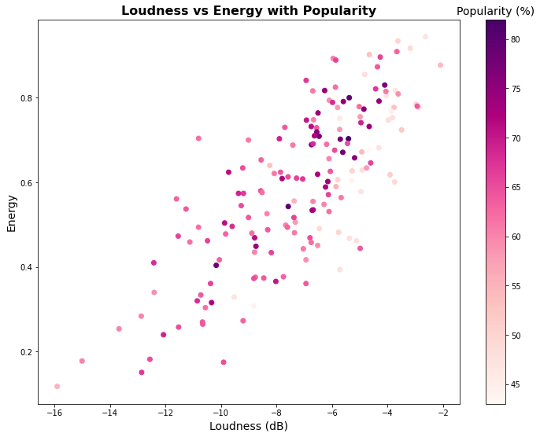
    


In the graph above, there is a clear relationship between loudness and energy. However, popularity has no clear relationship with these two features.


```python
plt.scatter(df["loudness"], df["acousticness"], c=df["popularity"], cmap="RdPu")
plt.title("Loudness vs Acousticness with Popularity", fontdict={"fontsize": 16, "fontweight": "bold"})
plt.xlabel("Loudness (dB)", fontdict={"fontsize": 14})
plt.ylabel("Acousticness", fontdict={"fontsize": 14})
plt.colorbar().ax.set_title("Popularity (%)", fontdict={"fontsize": 14})
plt.show()
```


    
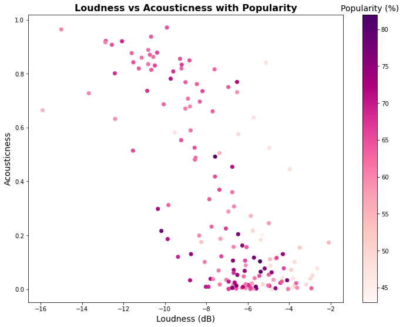
    


In the graph above, there is a clear relationship between loudness and acousticness. However, there is no clear relationship between these features and popularity.


```python
plt.scatter(df["energy"], df["popularity"], c=df["loudness"], cmap="RdPu")
plt.title("Energy vs Popularity with Loudness", fontdict={"fontsize": 16, "fontweight": "bold"})
plt.xlabel("Energy", fontdict={"fontsize": 14})
plt.ylabel("Popularity (%)", fontdict={"fontsize": 14})
plt.colorbar().ax.set_title("Loudness (dB)", fontdict={"fontsize": 14})
plt.show()
```


    
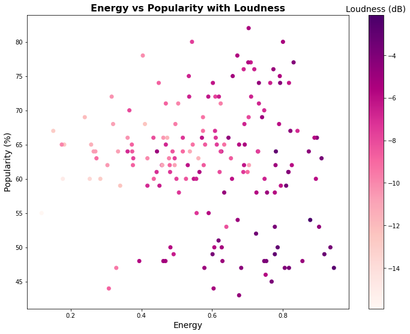
    


In the graph above, there is no clear relationship between energy and popularity. However, there seems to be a relationship between loudness and popularity. If this is true, then energy should also have a relationship with popularity. Yet the graph suggests otherwise.


```python
plt.scatter(df["acousticness"], df["popularity"], c=df["loudness"], cmap="RdPu")
plt.title("Acousticness vs Popularity with Loudness", fontdict={"fontsize": 16, "fontweight": "bold"})
plt.xlabel("Acousticness", fontdict={"fontsize": 14})
plt.ylabel("Popularity (%)", fontdict={"fontsize": 14})
plt.colorbar().ax.set_title("Loudness (dB)", fontdict={"fontsize": 14})
plt.show()
```


    
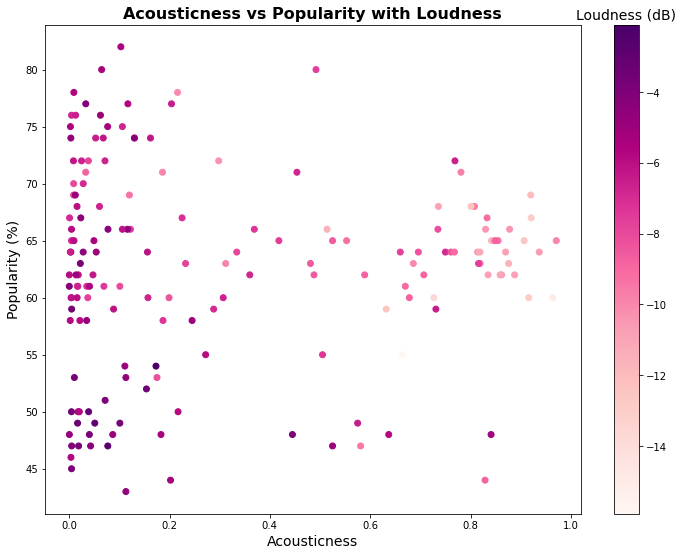
    


In the graph above, there is no clear relationship between acousticness and popularity. However, there seems to be a relationship between loudness and popularity. If this is true, then acousticness should also have a relationship with popularity. Yet the graph suggests otherwise.
 
The above examples suggest that loudness may not have a meaningful relationship with popularity, despite the weak correlation coefficient.

## Machine learning

Now we can train models to predict mean song popularity when given determinant features we identified in the dataset. The best model for a dataset is not always obvious, so we'll test four different ones to determine the best fit and use mean squared error, which is commonly used in regression analysis, as a metric for this. We'll examine linear, quadratic, cubic, and multi-layer perceptron regression models. We use regression because our data is numeric, not categorical.

We want to include release date as a training feature for the models, as Taylor Swift has become more popular over time. This is evident in every plot over time that we've shown. As such, we convert release date from datetime into numeric values, so the models can use them to predict popularity. We represent release date numerically as the number of months since the release of her first album.
 
In this section, we heavily use the sklearn library. To learn more, see the [sklearn user guide](https://scikit-learn.org/stable/user_guide.html).


```python
MONTH_OFFSET = 10
YEAR_OFFSET = 2006
YEAR_TO_MONTHS = 12

# Create a new column.
df["release_date_months"] = np.nan

for index, row in df.iterrows():
    date = df.at[index, "release_date"]
    months = (date.year - YEAR_OFFSET) * YEAR_TO_MONTHS + (date.month - MONTH_OFFSET)
    df.at[index, "release_date_months"] = months
```

First, we train a linear regression model, which is often a good baseline model for regression. We use the mean of each feature over time so our plot will show a clear line.


```python
# Linear model

from sklearn.linear_model import LinearRegression

release_date_months = set(df["release_date_months"])

# The training data and labels.
X = pd.DataFrame([mean_danceabilities, mean_speechinesses, release_date_months]).T
y = pd.DataFrame(mean_popularities)

# Initialize and train the linear regression model.
reg = LinearRegression()
reg.fit(X, y)

# Generate the predicted mean popularity.
y_pred = reg.predict(X)
```

Now we compute the mean squared error of the linear model. A value closer to 0 indicates low error.


```python
from sklearn.metrics import mean_squared_error

mse = mean_squared_error(y, y_pred)
```


```python
# Plot the actual and predicted mean popularity over time.
plt.plot(release_dates, y_pred, label="Predicted (Linear)", linewidth=3)
plt.plot(release_dates, mean_popularities, label="Actual", linewidth=3)

# Label the graph.
plt.title("Taylor Swift's Mean Song Popularity Over Time", fontdict={"fontsize": 16, "fontweight": "bold"})
plt.xlabel("Year", fontdict={"fontsize": 14})
plt.ylabel("Normalized Popularity", fontdict={"fontsize": 14})
plt.legend(fontsize=16, shadow=True)
plt.show()
```


    
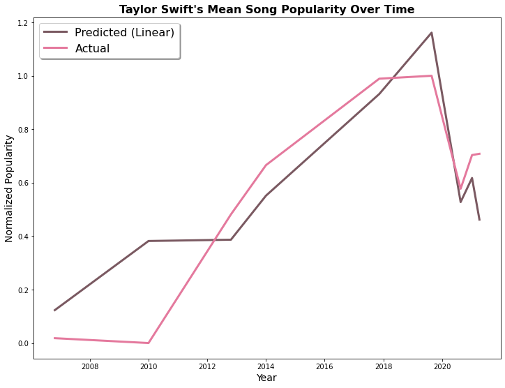
    


Note that the predicted popularity line does not appear linear. This is because it is linear with respect to mean_danceabilities, mean_speechinesses, and release_dates_months rather than release_date, which it is plotted over.
 
This model is fairly accurate, but it overestimates Taylor Swift's song popularity in the beginning of her career and in 2017-2019. This is unsurprising, as she gained popularity quickly starting in 2010, and she received a lot of negative media attention around 2017. So, the model thought her songs would be more popular than in reality.

We would like to consider polynomial regression next because the chosen features seem to have a polynomial relationship with popularity. This can be observed in the above graph "Taylor Swift's Mean Song Metrics Over Time."
 
First, let's examine a quadratic regression model to predict popularity.


```python
# Quadratic model

from sklearn.preprocessing import PolynomialFeatures

poly2 = PolynomialFeatures(degree=2, include_bias=False)

# The training data and labels.
X_poly2 = poly2.fit_transform(X)
y_poly2 = poly2.fit_transform(y)

# Train the model.
reg.fit(X_poly2, y_poly2)

# Generate the predicted mean popularity.
y_pred_poly2 = reg.predict(X_poly2)

# Compute the mean squared error.
mse_poly2 = mean_squared_error(y_poly2, y_pred_poly2)
```


```python
# Plot the actual and predicted mean popularity over time.
plt.plot(release_dates, y_pred_poly2[:,1], label="Predicted (Quadratic)", linewidth=3)
plt.plot(release_dates, mean_popularities, label="Actual", linewidth=3)

# Label the graph.
plt.title("Taylor Swift's Mean Song Popularity Over Time", fontdict={"fontsize": 16, "fontweight": "bold"})
plt.xlabel("Year", fontdict={"fontsize": 14})
plt.ylabel("Normalized Popularity", fontdict={"fontsize": 14})
plt.legend(fontsize=16, shadow=True)
plt.show()
```


    
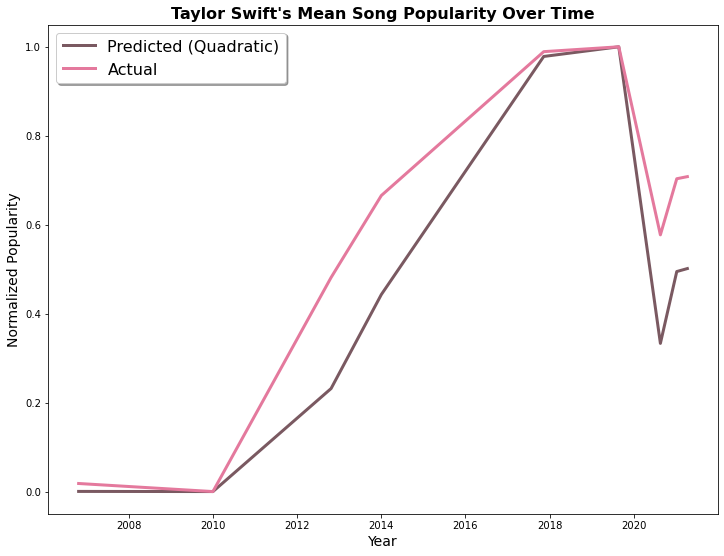
    


This model is even more visually accurate, but it sometimes underestimates Taylor Swift's song popularity. It is unsurprising that this model seems to perform better than the last since polynomials of higher degree tend to fit the data more closely. However, this is not necessarily favorable: the model could be overfitting. Overfitting occurs when the model matches the training data too closely and does not perform well on new data.
 
Next, let's examine a cubic regression model to predict popularity.


```python
# Cubic model

poly3 = PolynomialFeatures(degree=3, include_bias=False)

# The training data and labels.
X_poly3 = poly3.fit_transform(X)
y_poly3 = poly3.fit_transform(y)

# Train the model.
reg.fit(X_poly3, y_poly3)

# Generate the predicted mean popularity.
y_pred_poly3 = reg.predict(X_poly3)

# Compute the mean squared error.
mse_poly3 = mean_squared_error(y_poly3, y_pred_poly3)
```


```python
# Plot the actual and predicted mean popularity over time.
plt.plot(release_dates, y_pred_poly3[:,2], label="Predicted (Cubic)", linewidth=3)
plt.plot(release_dates, mean_popularities, label="Actual", linewidth=3)

# Label the graph.
plt.title("Taylor Swift's Mean Song Popularity Over Time", fontdict={"fontsize": 16, "fontweight": "bold"})
plt.xlabel("Year", fontdict={"fontsize": 14})
plt.ylabel("Normalized Popularity", fontdict={"fontsize": 14})
plt.legend(fontsize=16, shadow=True)
plt.show()
```


    
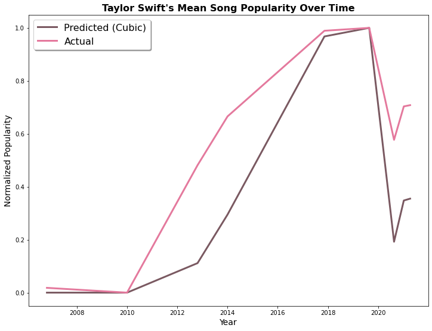
    


This model is less visually accurate than the last. It appears to underestimate Taylor Swift's song popularity to a greater degree.
 
Finally, let's examine a multi-layer perceptron model to predict popularity. This model is a neural network and offers complexity that the previous models do not. Since the perceptron is less intutive than the other models, see this [article](https://towardsdatascience.com/what-is-a-perceptron-basics-of-neural-networks-c4cfea20c590) to learn more.
 
In this section, we also normalize release_date_months since the MLPRegressor will give the feature more weight otherwise. 


```python
# Multi-layer perceptron model

from sklearn.neural_network import MLPRegressor

# Normalize the release date months.
df["norm_release_date_months"] = (df["release_date_months"] - df["release_date_months"].min()) / (df["release_date_months"].max() - df["release_date_months"].min())

# Initialize and train the model.
mlp = MLPRegressor(max_iter=100000)

norm_release_date_months = set(df["norm_release_date_months"])

# The training data and labels.
X_mlp = pd.DataFrame([mean_danceabilities, mean_speechinesses, norm_release_date_months]).T
y_mlp = pd.DataFrame(mean_popularities)

# Train the model.
mlp.fit(X_mlp, y_mlp.values.flatten())

# Generate the predicted popularity.
y_pred_mlp2 = mlp.predict(X_mlp)

# Compute the mean squared error.
mse_mlp2 = mean_squared_error(y_mlp, y_pred_mlp2)
```


```python
# Plot the actual and predicted mean popularity over time.
plt.plot(release_dates, y_pred_mlp2, label="Predicted (Neural Network)", linewidth=3)
plt.plot(release_dates, mean_popularities, label="Actual", linewidth=3)

# Label the graph.
plt.title("Taylor Swift's Mean Song Popularity Over Time", fontdict={"fontsize": 16, "fontweight": "bold"})
plt.xlabel("Year", fontdict={"fontsize": 14})
plt.ylabel("Normalized Popularity", fontdict={"fontsize": 14})
plt.legend(fontsize=16, shadow=True)
plt.show()
```


    
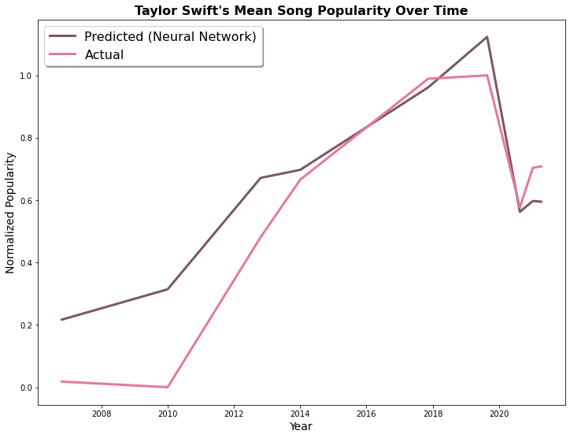
    


This model is the most visually accurate of the four, which looks promising but could also be a sign of overfitting. It both over- and underestimates Taylor Swift's song popularity, similar to the linear model but to a lesser extent.
 
Now, let's compare all models using their mean squared errors.


```python
print("Mean Squared Errors")
print("Linear:   ", mse)
print("Quadratic:", mse_poly2)
print("Cubic:    ", mse_poly3)
print("MLP:      ", mse_mlp2)
```

    Mean Squared Errors
    Linear:    0.030954557700792196
    Quadratic: 1.9960608356908799e-22
    Cubic:     2.1485694651236563e-24
    MLP:       0.023934372757104853


All models are fairly accurate. Although MLP appears to predict song popularity the best, the mean squared errors suggest otherwise. Using the mean squared errors, the models ranked from most to least accurate are:
 1. Cubic
 2. Quadratic
 3. MLP
 4. Linear

Now we take on the more daunting task of predicting the popularity of all songs, rather than just mean popularity. This is a more complicated endeavor due to the variable popularity of a song within an album. As such, it suits a neural network, like the multi-layer perceptron model, best.


```python
# Multi-layer perceptron model

# Train the model.
mlp.fit(df[["danceability", "speechiness", "norm_release_date_months"]], df["popularity"])

# Generate the predicted popularity.
y_pred_mlp = mlp.predict(df[["danceability", "speechiness", "norm_release_date_months"]])
```


```python
# Plot the actual and predicted popularity over time.
plt.scatter(df["release_date"], y_pred_mlp, label="Predicted (Neural Network)", marker='+')
plt.scatter(df["release_date"], df["popularity"], label="Actual", marker='x')

# Label the graph.
plt.title("Taylor Swift's Song Popularity Over Time", fontdict={"fontsize": 16, "fontweight": "bold"})
plt.xlabel("Year", fontdict={"fontsize": 14})
plt.ylabel("Popularity", fontdict={"fontsize": 14})
plt.legend(fontsize=16, shadow=True)
plt.show()
```


    
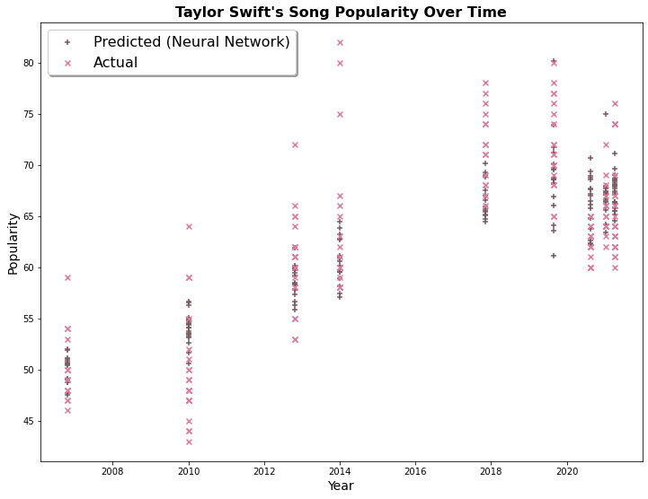
    


The predicted song popularity is rather compact but follows the actual popularity quite well. The variability of a song's popularity within an album is predicted to be lower than in reality. This is unsurprising, as the multi-layer perceptron model is resistant to highs and lows within the data.

## Conclusion

In the final step of the data pipeline, we reflect on all that we've uncovered.
 
We have learned several things over the course of this tutorial:
 1. Taylor Swift's song popularity is well correlated with release date, danceability, and speechiness.
 2. Taylor Swift's song popularity is not well correlated with loudness. It is a coincidental relationship.
 3. A cubic model performs the best at predicting Taylor Swift's mean song popularity.
 4. Predicting the popularity of all Taylor Swift songs is challenging but can be done with the multi-layer perceptron model.
